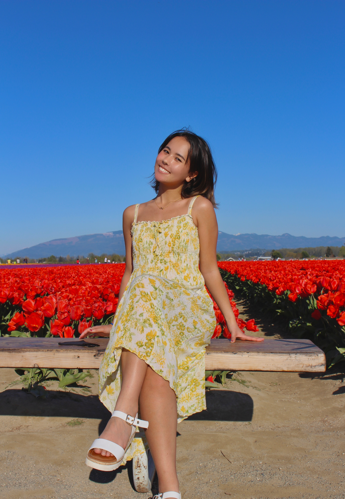

# Nicole Saho Okimoto Wentworth
wentwnic@uw.edu
http://www.example.com
https://www.linkedin.com/in/nicole-saho-okimoto-wentworth/
 

># About Me
>Currently matriculated at the University of Washington and exploring careers in the environmental field, I am pursuing a Bachelor of Arts in Environmental Studies and a minor in Geography. My interests include closing the gap between the hard sciences and the general public, environmental justice, environmental consulting/management, and community outreach.

# Education
## University of Washington (Seattle, WA)
 [Program of the Environment (POE)](https://envstudies.uw.edu/undergraduate-students/) 

(2019-2023)

Expected Graduation Date: June 2023
Major in Environmental Studies and a minor in Geography

Dean's List: Fall 2019, Spring 2020, Sophomore year, Junior year, and fall 2022

# Work Experience 

#### Environmental Consulting Intern  (Seattle, WA)
[King County Waste Division Department](https://kingcounty.gov/depts/dnrp/wtd.aspx) 
(Sep 2021 - Dec 2021)

Facilitated interviews with community representatives to assess the concerns or current issues of the neighborhoods in South Park, Seattle to implement their voices for the King County Wastewater Division Community Co-Design Project and identify corrective measures.

While working closely with King County, we met on a weekly basis to coordinate future plans, evaluate progress, and determine timelines. 

After interviewing community representatives in South Park, studying the objectives of the Co-Design Project, and learning about the history of South Park and past projects, we delivered **a final report on specific suggestions and recommendations for their plan to implement a sewage storage tank underground.** 

#### Bilingual Recycling Educational Outreach (Kirkland, WA)
[Waste Management](https://www.wm.com/) 

(Jun 2021 - Aug 2021)

Increased education and awareness of recycling through outreach

Developed network relationships with industry professionals to enhance community awareness and promote services.

Communicated with groups and individuals of diverse communities, interests, and perspectives using appropriate language and hands-on and online skills.

**Visited over 3,500 properties for waste audits, contacted over 3,700 businesses and properties for outreach** 

>## Summary of Skills 
>* Adaptable and resilient student with experience in consulting and research
>*  Excellent communicator in scientific writing, as well as in interpersonal relations
>* Proactive and organized worker with experience in compiling and manipulating data
>* Strong interest in cultivating community engagement and promoting sustainability in all sectors
>* Fluent in Japanese

